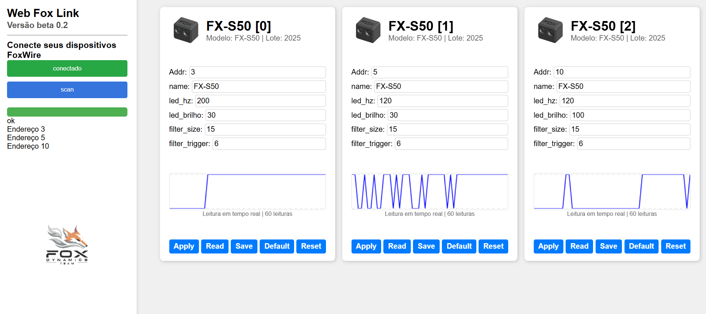

# FoxLink_web_tool

link: https://luisf18.github.io/FoxLink_web_tool/

**Exemplo:**

**Dispositivos suportados**  
Por enquanto esses são os dispositivos suportados:
- ✅ FX-S50
- ❌ FX-S200
- ❌ NEW ESC

**Ideias de Mellhorias**  
- Indicador em tempo para cada parametro, informando se ja foi atualizado ou não ( 🔴🟢 )
- Botões individuais para cada parametro de default, read e apply.
- Colocar cores diferentes nos botões em função do estado (se ja foi salvo ou se esta atualizado)
- Botão de calibração automatica para FX-S50
- Suporte ao modo shell, serial monitor e plotter
