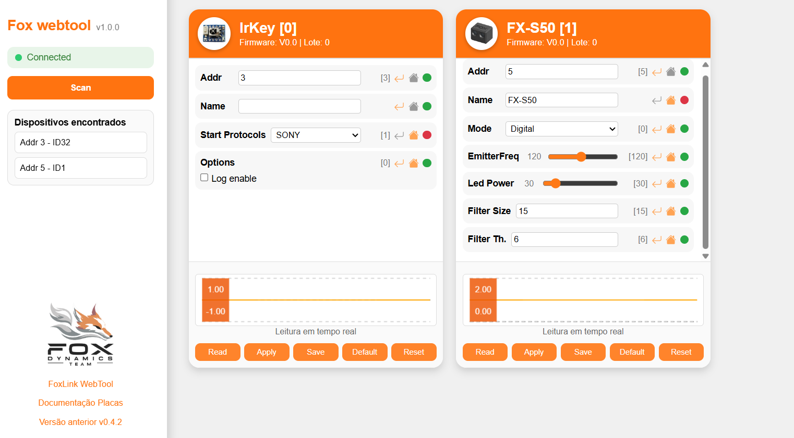
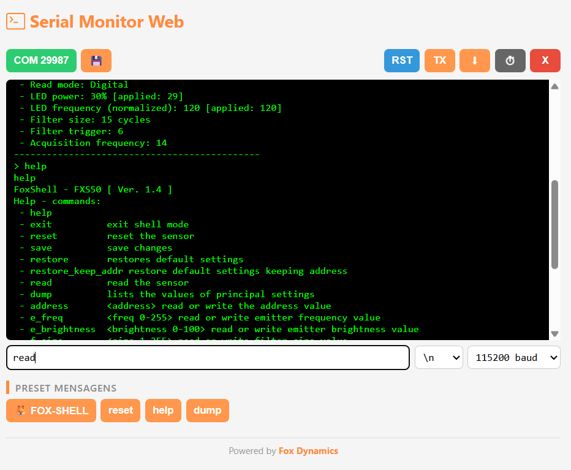
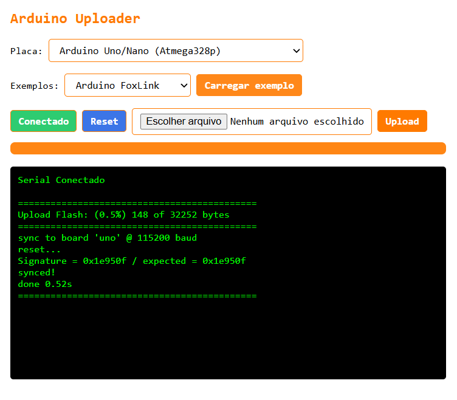
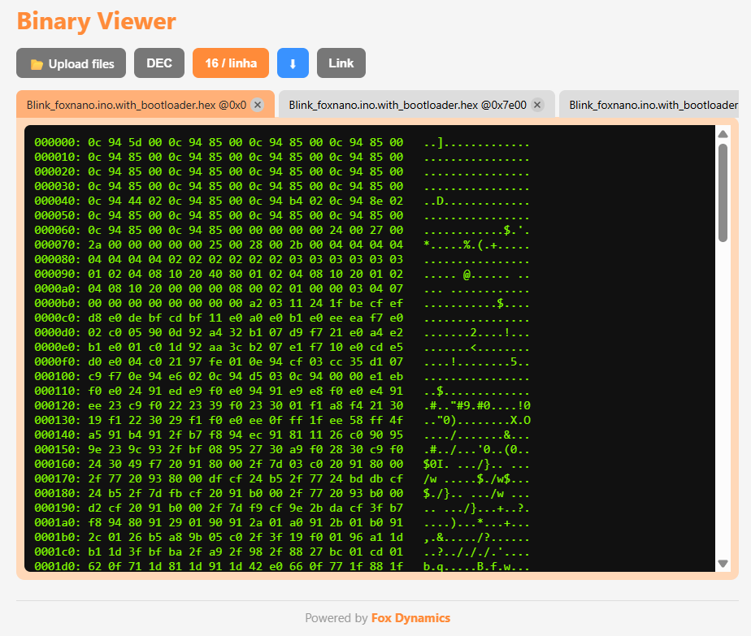
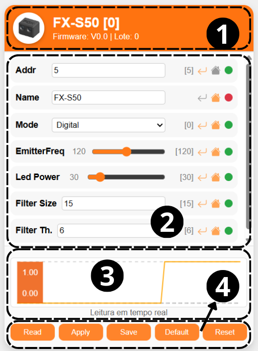
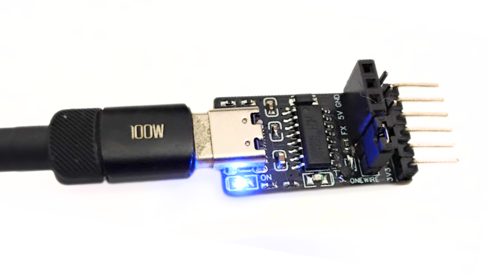
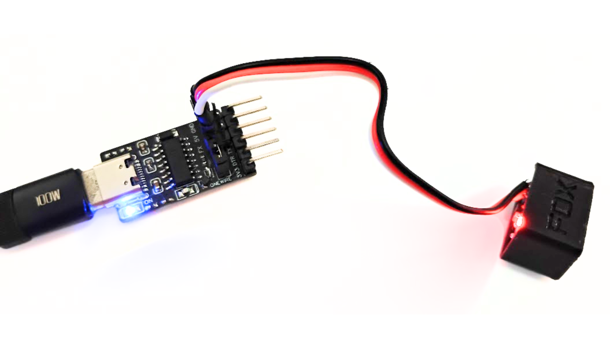
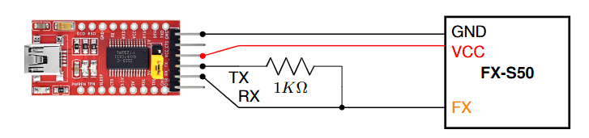
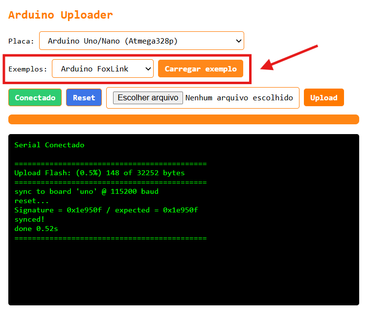
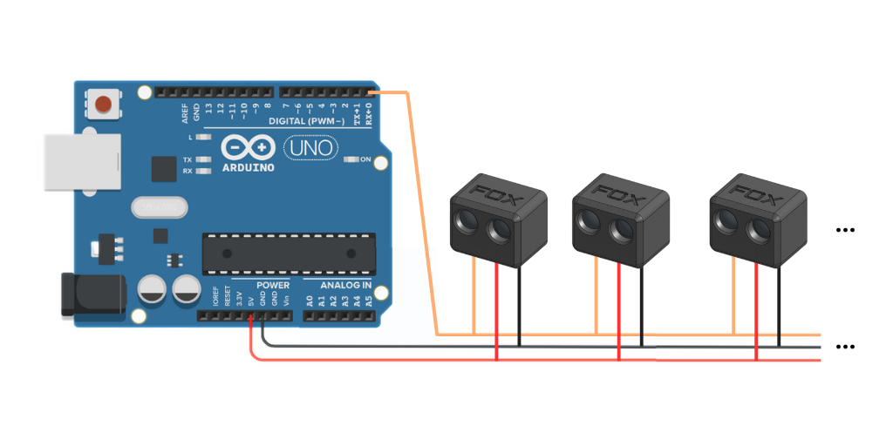

# FoxLink_webtool V1.0.2

_FoxLink_web_tool_ é um conjunto de ferramentas web para configurar módulos, ESCs e sensores da `Fox Dynamics` ou outros dispositivos que utilizem o protocolo `FoxWire`. A ferramenta também possui um `Serial monitor` similar ao do Arduino IDE com alguns recursos extras e também um `Arduino Uploader` que permite carregar codigos binarios ja compilados para Arduino.

🔗 [FoxLink webtool](https://luisf18.github.io/FoxLink_web_tool/)  
💻 [Serial Monitor](https://luisf18.github.io/FoxLink_web_tool/serial.html)  
📥 [Arduino Uploader](https://luisf18.github.io/FoxLink_web_tool/uploader)  
📝 [Binary viewer](https://luisf18.github.io/FoxLink_web_tool/binaryViewer.html)

## [FoxLink Webtool](https://luisf18.github.io/FoxLink_web_tool/)



## [Serial Monitor Web](https://luisf18.github.io/FoxLink_web_tool/serial.html)



## [Arduino Uploader](https://luisf18.github.io/FoxLink_web_tool/uploader)



## [Binary viewer](https://luisf18.github.io/FoxLink_web_tool/binaryViewer.html)



---

# Sobre o FoxLink WebTool

## Dispositivos Suportados
Atualmente, os seguintes dispositivos são suportados:
- ✅ [FX-S50](https://github.com/luisf18/FXDevices/tree/main/Sensor_FXS50)
- ✅ IR-Key
- ❌ FX-S200
- ❌ ESCs Brushed (em breve)

## Versões anteriores
- Versão anterior [beta v0.4.2](https://luisf18.github.io/FoxLink_web_tool/v0)

## Como Usar?

1. Acesse o link acima para abrir a ferramenta.
2. Clique no botão **Conectar** e selecione a porta COM do `FoxLink`.
   - **Dica**: verifique se a porta COM não está em uso por outro aplicativo, como o Arduino IDE ou um fatiador 3D. Caso esteja, feche o outro aplicativo e reinicie a página.
3. Clique no botão **Scan** para buscar sensores na rede `FoxWire`.
4. A ferramenta listará os endereços onde encontrou dispositivos e irá gerar uma pequena janela de configuração para cada um.
5. Para realizar um novo scan, basta clicar novamente em **Scan** e aguardar.

## Como configurar?



### Descrição de cada parte
1. **Identificação do dispositivo:** Foto, Nome, Modelo e Lote.
2. **Parâmetros** Parametros que podem ser alterados.
3. **Gráfico em tempo real da leitura do dispositivo.**
4. **Botões de ação do sensor:**
    - `Read`: Lê o valor de cada parâmetro no dispositivo.
    - `Apply`: Aplica os valores de cada parâmetro no dispositivo.
    - `Save`: Salva permanentemente as configurações aplicadas.
    - `Default`: Retorna à configuração padrão. Para salvar essa configuração, é necessário clicar em `Save` em seguida.
    - `Reset`: Reinicia o dispositivo e após o reset lê (`Read`).  


Cada parâmetro possui 3 icones do lado direito. Eles indicam se:

- `Return` se o valor atual é o mesmo que o lido do dispositivo. ao clicar ele retorna pro valor lido.
- `Home` se o valor atual é o mesmo que o valor default,
ao clicar vai para o valor default.
- `Circulo` se o valor atual ja foi salvo (🟢 Verde = Salvo, 🔴 Vermelho = Não salvo), não é clicavel. (*)

<!-- _(*) obs:_ Na versão atual do FoxWire não existe um comando que verifique se de fato o parametro esta salvo, então ele faz isso baseado na leitura e se o comando `save` ja foi executado. Portando em casos onde foi aplicada uma alteração não salva antes do `scan` ele não tem como saber se esta salvo ou não.-->

### No FX-S50 Como alterar o alcance do sensor 📏
A forma mais simples é alterando o parâmetro `led power`, que controla a luminosidade do emissor do sensor. Quanto maior a luminosidade, maior o alcance. Este parâmetro pode variar de 5 a 100.

## Ideias de Melhorias
- 🟡 Usar a cor amarela para _Apply_
- Diferenciar as cores dos botões com base no estado (se já foi salvo ou se está atualizado)
- Exibir a tensão e temperatura em tempo real
- Calibração automática para o [FX-S50](https://foxdynamics.com/fx-s50)

---

# Como conectar com o computador?

Um FoxLink é a placa que faz a comunicação entre o computador e os dispositivos. É um conversor USB Serial configurado para funcionar em modo HalfDuplex. É recomendado usar o FoxLink oficial, mas também é possovel montar, a seguir as alternativas.

## [Opção 1] FoxLink oficial ⭐️

A fox fornece um FoxLink oficial multiprotocolo. Ele é 4 em 1, funciona com dispositivos Fox (FoxWire), ESCs BLHeli e AM32 e também pode ser usando como conversor USB serial. O uso é simples basta conectar o device nos primeiros 3 pinos (conforme a imagem). Obs: no modo foxlink, am32 e BlHeli o jumper precisa estar conectado.




## [Opção 2] FoxLink usando um conversor USB Serial

Conecte o TX da placa com o RX usando um resistor de 1Kohm. O pino RX será o pino de comunicação (Pino FX) que deverá ser conectado aos sensores.



## [Opção 3] FoxLink usando Arduino Nano ou UNO

Outra opção é usar um **Arduino Nano** ou **UNO** como interface entre o computador e os dispositivos Fox. No entanto, a comunicação não é tão estavel como usando um conversor USB Serial ou FoxLink oficial. Por isso, se for usar, teste mais de uma vez se as configurações de fato foram salvas.

### Código FoxLink bitwise ASM

Abra o Arduino IDE, faça upload do código abaixo, em seguida conecte o pino de sinal do sensor, "FX", ao pino 0 também conhecido como "RX".

✅ _A versão atual melhorou significativamente o desempenho._

```c++
// Fox Dynamics Team
// FoxLink bitwise ASM V0.2
#include <avr/io.h>

int main() {
  DDRD = (1 << PD1);
  PORTD = (1 << PD0);
  while (1) {
      asm volatile (
          "in r0, %[pin]" "\n\t"
          "bst r0, 0" "\n\t"
          "bld r0, 1" "\n\t"
          "out %[port], r0" "\n\t"
          :
          : [pin] "I" (_SFR_IO_ADDR(PIND)),
            [port] "I" (_SFR_IO_ADDR(PORTD))
          : "r0"
      );
  }
}
```

### Use o Arduino Uploader

O webtool disponibiliza um [`Arduino uploader`](https://luisf18.github.io/FoxLink_web_tool/uploader) que permite fazer upload de binarios ja compilados para Arduino. Para carregar o código do `Arduino Foxlink` acesse o [`Arduino uploader`](https://luisf18.github.io/FoxLink_web_tool/uploader), escolha e conecte a placa, depois selecione o exemplo `Arduino Foxlink` e clique em `Carregar exemplo`. O codigo será instalado e a placa ja estará pronta para uso com o [`FoxLink webtool`](https://luisf18.github.io/FoxLink_web_tool)






