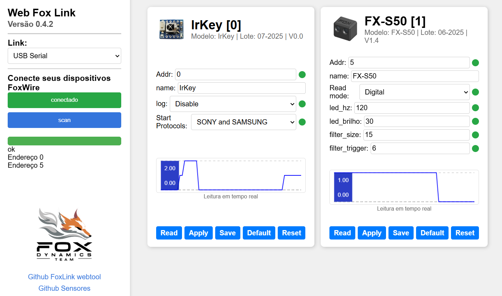
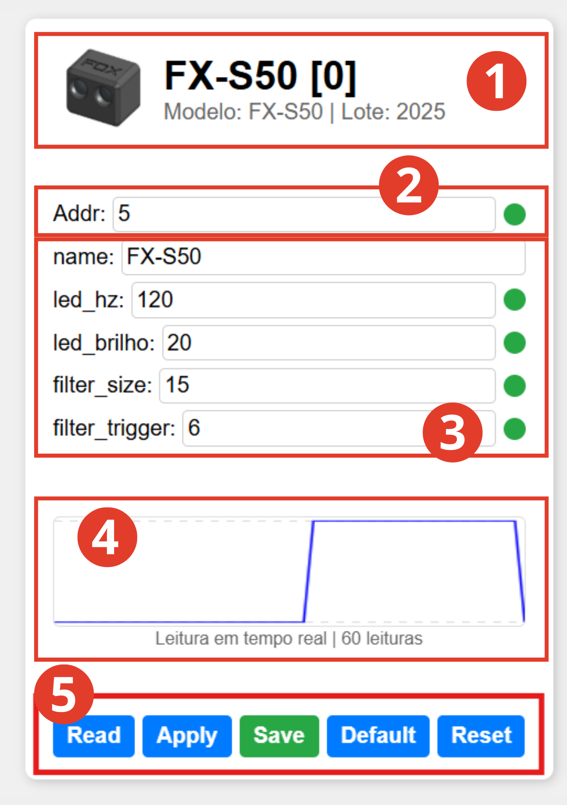

# FoxLink_web_tool

_FoxLink_web_tool_ é uma ferramenta web para configurar as placas e sensores da _Fox Dynamics_ ou outros dispositivos que utilizem o protocolo FoxWire. A ferramenta foi criada recentemente, então, até o momento, só tem suporte ao sensor [FX-S50](https://github.com/luisf18/FXDevices/tree/main/Sensor_FXS50) e ainda não possui interface para o modo Shell.

🔗 [Acesse a ferramenta aqui](https://luisf18.github.io/FoxLink_web_tool/)

---

## Exemplo


---

## Dispositivos Suportados
Atualmente, os seguintes dispositivos são suportados:
- ✅ [FX-S50](https://github.com/luisf18/FXDevices/tree/main/Sensor_FXS50) [ V1.2 e V1.3 ]
- ✅ IR-Key
- ❌ FX-S200
- ❌ NEW ESC

---

# Como Usar?

🔗 [Acesse a ferramenta aqui](https://luisf18.github.io/FoxLink_web_tool/)

1. Acesse o link acima para abrir a ferramenta.
2. Selecione o tipo de placa que está utilizando para se comunicar com o sensor (Arduino ou Conversor USB-Serial). Para saber como preparar esta placa, consulte a seção [_Placa FoxLink_](#placa-Fox-Link).
3. Clique no botão **Conectar** e selecione a porta COM da placa.
   - ❌ Se o botão permanecer vermelho, significa que a conexão não foi estabelecida.
   - Dica: verifique se a porta COM não está em uso por outro aplicativo, como o Arduino IDE ou um fatiador 3D. Caso esteja, feche o outro aplicativo e reinicie a página.
4. ✅ Após conectar, o botão ficará **verde**, indicando sucesso na conexão.
5. 🟦 Clique no botão **Scan** para buscar sensores na rede FoxWire.
6. A ferramenta listará os endereços onde encontrou sensores e irá gerar uma pequena janela de configuração para cada um.
7. Para realizar um novo scan, basta clicar novamente em **Scan** e aguardar.

---

## Como configurar o sensor FX-S50?



### Descrição de cada parte
1. **Identificação do sensor:** Foto, Nome, Modelo e Lote.
2. **Endereço do dispositivo na rede FoxWire:** Lembrando que o endereço de cada sensor deve ser único. Caso dois sensores com o mesmo endereço estejam presentes na mesma rede, isso pode corromper a comunicação. Conecte um de cada vez e salve um endereço diferente para cada.
3. **Parâmetros de controle do sensor:** Cada parâmetro possui um ícone ao lado que indica se ele está salvo na memória do sensor (🟢 Verde = Salvo, 🔴 Vermelho = Não salvo). O botão **Save** só ficará verde se todos os parâmetros estiverem salvos.
4. **Gráfico em tempo real da leitura do sensor.**
5. **Botões de ação do sensor:**
    - **Read:** Lê cada parâmetro do sensor e atualiza os respectivos campos.
    - **Apply:** Ao alterar um parâmetro, clique em Apply para passar a alteração para o sensor.
    - **Save:** Salva as configurações digitadas na memória não volátil do sensor. Assim, mesmo reiniciando ou desligando, as configurações serão mantidas.
    - **Default:** Retorna o sensor à configuração padrão. Para salvar essa configuração, é necessário clicar em **"Save"** em seguida.
    - **Reset:** Reinicia o sensor e, após o reset, lê os parâmetros e atualiza os respectivos campos.

### Como alterar o alcance do sensor 📏
A forma mais simples é alterando o parâmetro **led_brilho**, que controla a luminosidade do emissor do sensor. Quanto maior a luminosidade, maior o alcance. Este parâmetro pode variar de 5 a 100.

---

## Versões anteriores
- Versão [beta 0.2](https://luisf18.github.io/FoxLink_web_tool/index_foxwire_v0_2)

---

## Ideias de Melhorias
- ✅ Indicador em tempo real para cada parâmetro, informando se já foi atualizado ou não (🔴🟢)
- 🟡 Usar a cor amarela para _Apply_
- Tornar o botão de status clicável
- Adicionar botões individuais para cada parâmetro (_Default_, _Read_ e _Apply_)
- ✅ Cor diferente no botão de salvar
- Diferenciar as cores dos botões com base no estado (se já foi salvo ou se está atualizado)
- Botão de calibração automática para o [FX-S50](https://foxdynamics.com/fx-s50)
- Campo para nomeação do FX-S50 (ainda não implementado)
- Suporte ao modo _Shell_, _Serial Monitor_ e _Plotter_
- Adicionar status de conexão

---

# Placa Fox Link

A placa Fox Link é o circuito que faz a comunicação entre o computador e os dispositivos. É um conversor USB Serial configurado para funcionar em modo HalfDuplex. A seguir algumas formas de montar.

## [Opção 1] Fox Link usando um conversor USB Serial ⭐️

Conecte o TX da placa com o RX usando um resistor de 1Kohm. O pino RX será o pino de comunicação (Pino FX) que deverá ser conectado aos sensores.

**OBS:** Essa é a forma mais estavel de se comunicar com  os sensores.


## [Opção 2] Fox Link usando Arduino Nano ou UNO

A segunda opção é usar um **Arduino Nano** ou **UNO** como interface entre o computador e os sensores. No entanto, a comunicação não é tão estavel como usando um conversor USB Serial, recomendo se for usar testar mais de uma vez se as configurações de fato foram salvas.

### Código FoxLink bitwise ASM

Abra o Arduino IDE, faça upload do código abaixo, em seguida conecte o pino de sinal do sensor, "FX", ao pino 0 também conhecido como "RX".

✅ _A versão atual melhorou significativamente o desempenho._

```c++
// Fox Dynamics Team
// FoxLink bitwise ASM V0.2
#include <avr/io.h>

int main() {
  DDRD = (1 << PD1);
  PORTD = (1 << PD0);
  while (1) {
      asm volatile (
          "in r0, %[pin]" "\n\t"
          "bst r0, 0" "\n\t"
          "bld r0, 1" "\n\t"
          "out %[port], r0" "\n\t"
          :
          : [pin] "I" (_SFR_IO_ADDR(PIND)),
            [port] "I" (_SFR_IO_ADDR(PORTD))
          : "r0"
      );
  }
}
```


